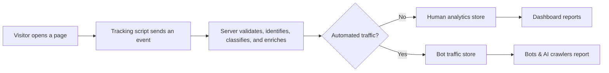

tinyanalytics works through three connected parts: a **tracking script** in the browser, a **server** that receives and enriches events, and a **dashboard** that turns stored events into reports. Core anonymous analytics uses no cookies at any step.



## What happens when someone visits your site

1. The visitor loads a page. The tracking script runs after the HTML parses (`defer`).
2. The script builds a small event — the path, page title, referrer, screen size, and language — and sends it to the tinyanalytics server with a `POST` request.
3. The server matches the visit to a cookieless identity, filters out bots, and adds details it can derive itself: country, browser, operating system, device, and traffic channel.
4. The event is written to the analytics database, and the visit shows up in your dashboard within seconds.

The script only sends what it can directly observe in the browser. Everything else — who the visitor is, where they are, and how they arrived — is worked out on the server, so the script stays small (**under 6.5 KB** gzipped) and fast.

## How does tinyanalytics count visitors without cookies?

tinyanalytics identifies a visitor with a short, one-way hash instead of a cookie. The server derives it from the visitor's IP address and browser user-agent, hashes them together, and keeps only the first 12 characters:

```text
user_id = sha256(ip + user_agent) truncated to 12 characters
```

Nothing is written to the visitor's device, and the raw IP address is not stored as the identifier — only the hash is. This is what lets the multi-day **Users**, **Retention**, and **Cohorts** reports work at all, because the same person tends to hash to the same value from one day to the next.

### It's an estimate, and tinyanalytics says so

A cookieless count cannot be exact. There are two kinds of error, and both are unavoidable for any tool that avoids cookies:

- **Undercount** — several people behind one office or home network, all using the same browser, can collapse into a single visitor.
- **Overcount** — one person who switches from Wi-Fi to mobile data, or whose browser updates its user-agent, can be counted as a new visitor.

Plausible, Umami, and other cookieless tools live with the same class of error. When you need exact, cross-device accuracy for signed-in users, [`identify()`](/user-identification-analytics) is the escape hatch.

## How does identify() make counts exact?

When your app calls [`identify(userId)`](/user-identification-analytics), tinyanalytics attaches that ID to the visitor's recent activity — it backfills the last 30 days of that fingerprint's events — and every people report then keys on your ID instead of the hash. The result: one signed-in person on a phone and a laptop counts as **one** user across Overview, Users, Retention, and Cohorts, and the numbers on different pages agree.

## What is a session?

A session is one visitor's activity within a **30-minute sliding window of inactivity**. Every new event pushes the window forward; the session only ends after 30 minutes of silence. Because the window slides rather than resetting on a fixed clock, a visitor who is active across a boundary (for example, at the top of the hour) stays in one session instead of being split in two.

## What data does the script send?

The script sends only what it can read in the page:

- The path, page title, and query string
- The referrer
- Screen width and height, and the browser language
- Custom events you choose to send, and their properties

It does **not** send cookies, and it does not read personal data from the page. Identity, geolocation, browser, operating system, device, and traffic channel are all derived on the server from the request itself, never stored on the visitor's device.

## Related

<Columns cols={2}>
  <Card title="Identify users" icon="user" href="/user-identification-analytics">
    Attach stable user IDs for exact, cross-device people counts.
  </Card>
  <Card title="Install the tracking script" icon="code" href="/install-tinyanalytics-tracking-script">
    Add the script and choose what it tracks.
  </Card>
  <Card title="Cookieless identity" icon="fingerprint" href="/resources/cookieless-analytics-identity">
    The hash, its lifetime, and what it can and can't tell you.
  </Card>
  <Card title="Bot detection" icon="robot" href="/resources/analytics-bot-detection">
    How tinyanalytics keeps crawlers out of your numbers.
  </Card>
</Columns>
