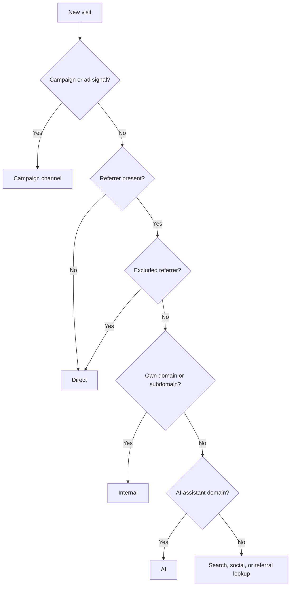

tinyanalytics labels every visit with a single marketing **channel** — where the visitor came from — by reading the visit's referrer and its campaign (UTM) parameters. This is what powers your acquisition reports, so you can see which sources actually drive traffic.

## The channels

A visit is classified into one channel, such as:

`Direct` · `Organic Search` · `Paid Search` · `Organic Social` · `Paid Social` · `Referral` · `Email` · `AI` · `Display` · `Affiliate` · `Internal` · `Unknown`

## How the channel is decided

Classification reads three inputs and applies them in a fixed order:

- **Campaign parameters** — `utm_source`, `utm_medium`, `utm_campaign`, and ad click IDs (`gclid`, `gad_source`) take priority when present. They're how a link tells tinyanalytics exactly which channel it belongs to.
- **Referrer** — when there are no campaign parameters, the referring domain decides the channel: a search engine means Organic Search, a social network means Organic Social, and so on.
- **No referrer** — a visit with no referrer and no campaign parameters is **Direct**.

Two rules resolve the overlaps:

- **Paid beats organic** — a visit from a search source *with* a paid signal (an ad medium or a click ID) is Paid Search, not Organic Search.
- **AI is checked before search** — a visit from an AI assistant's domain is classified as AI rather than being mistaken for a search engine.

<Note>
  A visit from one of your own pages to another is labeled **Internal**, not counted as a new external referral — so on-site navigation doesn't pollute your acquisition data.
</Note>

## How are visits between my own subdomains classified?

Hops between your root domain and any of its subdomains are **Internal**, in both directions — `example.com` to `app.example.com` and `app.example.com` back to `example.com`. The visitor stays in one session and no referral is recorded.

**Sibling subdomains are the exception.** A hop from `app.example.com` to `blog.example.com` is still classified as a **Referral**, because neither domain contains the other. To fold those into your direct traffic, add your root domain to **Referrer Exclusions** — see [exclude traffic](/exclude-traffic-from-analytics#how-do-i-stop-a-referrer-from-showing-up-as-a-referral).

An excluded referrer is reported as **Direct**, not Internal. The two labels mean different things: Internal marks navigation inside your own site, while Direct means tinyanalytics has no referrer to attribute the visit to. Campaign parameters still take priority over both — a UTM-tagged link from an excluded referrer keeps its campaign channel.

## Tag your own links

To classify your campaigns precisely, add UTM parameters to the links you control — for example `?utm_source=newsletter&utm_medium=email`. tinyanalytics reads them and files the visit under the right channel, and you can break any report down by source, medium, or campaign.

## Related

<Columns cols={2}>
  <Card title="AI traffic" icon="microchip" href="/ai-referral-traffic-analytics">
    Visits that arrive from AI assistants.
  </Card>
  <Card title="Shortlinks" icon="link" href="/trackable-short-links">
    Trackable links that carry campaign tags.
  </Card>
  <Card title="Dashboard overview" icon="gauge" href="/web-analytics-dashboard">
    See your traffic by channel.
  </Card>
  <Card title="How bot detection works" icon="robot" href="/resources/analytics-bot-detection">
    How non-human traffic is filtered first.
  </Card>
</Columns>
