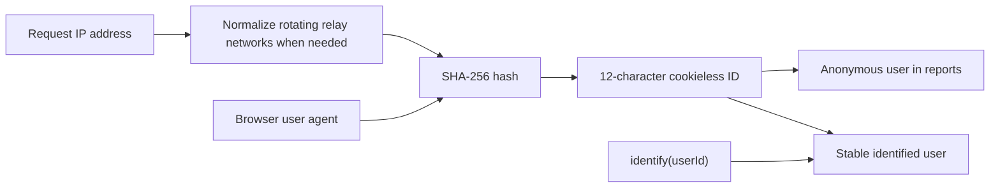

Cookieless analytics identity estimates anonymous visitors without cookies or a stored browser ID. tinyanalytics derives a one-way ID on the server and stores that result instead of the raw IP address.

## How a visitor is identified

When an event arrives, tinyanalytics computes a short **cookieless ID** by hashing the visitor's IP address and user agent together. The raw IP address is never stored — only the resulting hash, which can't be reversed back into an IP. That ID is stable for as long as the visitor's IP-and-browser pair is, which is what makes multi-day reports like [Users](/user-analytics), [retention](/user-retention-analytics), and [cohorts](/behavioral-cohort-analysis) meaningful.

## It's an accurate estimate — and honest about its limits

A cookieless ID can't be exact, and tinyanalytics doesn't pretend otherwise. There are two inherent, opposite kinds of error:

- **Undercounting** — several people behind one network (a household or office) on the same browser build collapse into one visitor.
- **Overcounting** — one person moving from Wi-Fi to cellular, or updating their browser, can look like a new visitor.

Every cookieless analytics tool lives with this trade-off. When you need exact, cross-device identity, [identify](/user-identification-analytics) is the escape hatch.

## How does tinyanalytics handle VPNs and privacy relays?

Some visitors browse through networks that **change their IP between requests** — VPNs, Cloudflare WARP, iCloud Private Relay, and corporate web proxies. Without a guard, a single person rotating IPs mid-visit would explode into many phantom visitors, splitting one session into several and corrupting bounce rate and channel attribution.

tinyanalytics recognizes these rotating **datacenter and hosting networks** and steadies identity for them in two ways:

- It derives the ID from a **coarse network bucket** (a `/24` block for IPv4, `/48` for IPv6) instead of the exact rotating IP, so consecutive requests from the same relay land on the same visitor.
- It can briefly **re-attach** a freshly rotated ID to the visitor it just belonged to, within a short window.

This is deliberately biased toward safety: it only ever **merges** near-identical visitors on the same network with the same browser, and never splits a visitor further. When it isn't confident, it leaves them separate — the same behavior as before. It applies only to identity — a visitor's IP is still never stored — and only to events collected after the change; existing history is untouched. Regular home and mobile visitors are unaffected.

## Turning a visitor into a known person

When your app calls `identify()` with a stable ID, tinyanalytics attributes that visitor's recent anonymous activity to the ID and counts them as one person from then on — across devices and sessions. Reports then key on the identified ID when there is one, and fall back to the cookieless ID when there isn't, so a signed-in person on two devices is a single user everywhere.

<Note>
  `identify()` persists the user ID you provide in browser storage. Feature flags, groups, surveys, and browser opt-out also store purpose-specific state. Core anonymous analytics does not store an analytics ID in the browser. See [Privacy & GDPR](/resources/privacy-friendly-analytics-gdpr).
</Note>

## Related

<Columns cols={2}>
  <Card title="Privacy & GDPR" icon="user-shield" href="/resources/privacy-friendly-analytics-gdpr">
    The privacy properties this design gives you.
  </Card>
  <Card title="Identify users" icon="user" href="/user-identification-analytics">
    Attach a stable ID for exact identity.
  </Card>
  <Card title="How your data is handled" icon="server" href="/resources/analytics-data-handling">
    What's stored, and what never is.
  </Card>
  <Card title="Metric definitions" icon="ruler" href="/resources/analytics-metrics-glossary">
    How "users" and "sessions" are counted.
  </Card>
</Columns>
